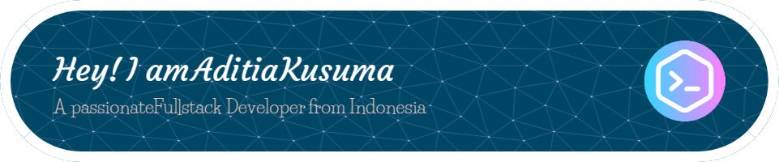

<!-- Profile README Template -->

  

---

### 👨‍💻 About Me

- 🔭 I’m currently working on **[Payment Gateway Project]**
- 🌱 I’m currently learning **[React TS]**
- 💬 Ask me about **[Vue/React TS]**
- 📫 How to reach me: **[aditiakusuma800@gmail.com]**

---

### 📊 GitHub Stats

  
   
  
   
  

---

### 🛠️ Tech Stack

  

---

### 🌐 Connect with Me

  
  

---

### 🧮 Visitor Counter

  

---

> ⭐️ Don't forget to star your favorite repositories!

